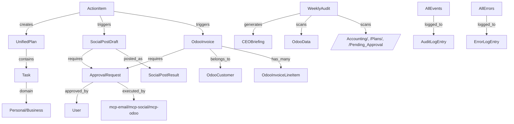

# Data Model: Gold Tier - Autonomous Employee

**Feature**: 003-gold-tier
**Created**: 2026-02-20
**Status**: Complete
**Builds On**: Phase 1 (ActionItem) + Phase 2 (ApprovalRequest, Plan, LinkedInPost, EmailDraft)

---

## Entity Overview

### New Entities (Gold Tier)
1. **OdooInvoice** - Draft and posted invoices in Odoo
2. **OdooCustomer** - Customer/contact records in Odoo
3. **OdooTransaction** - Financial transactions in Odoo
4. **SocialPostDraft** - Platform-agnostic social post (LinkedIn, FB, IG, X)
5. **SocialPostResult** - Posted social media with engagement metrics
6. **CEOBriefing** - Weekly business report
7. **AuditLogEntry** - Audit trail entry
8. **ErrorLogEntry** - Error log entry
9. **UnifiedPlan** - Cross-domain plan (extends Phase 2 Plan)

### Extended Entities (from Phase 2)
- **ActionItem** - Adds domain label ([Personal]/[Business])
- **ApprovalRequest** - Adds support for Odoo and social approvals
- **Plan** - Adds cross-domain task support

---

## Entity Definitions

### OdooInvoice

**Purpose**: Represents a draft or posted invoice in Odoo accounting system

**Fields**:
```yaml
invoice_id:
  type: integer
  description: Odoo internal invoice ID
  required: true
  unique: true

customer_id:
  type: integer
  description: Odoo partner (customer) ID
  required: true
  reference: OdooCustomer.partner_id

line_items:
  type: array of objects
  required: true
  items:
    product_id: integer
    quantity: decimal
    price_unit: decimal
    price_subtotal: decimal
    description: string

total_amount:
  type: decimal
  required: true
  validation: >= 0

status:
  type: enum
  values: [draft, posted, paid, cancelled]
  required: true
  default: draft

due_date:
  type: date (YYYY-MM-DD)
  required: true

invoice_date:
  type: date (YYYY-MM-DD)
  required: true
  default: today

vault_file_path:
  type: string (path)
  description: Path to invoice draft .md in vault
  required: false

created_at:
  type: datetime (ISO-8601)
  required: true
  auto_generated: true

posted_at:
  type: datetime (ISO-8601)
  required: false
```

**Relationships**:
- `belongs_to`: OdooCustomer (many-to-one)
- `has_many`: OdooInvoiceLineItem (one-to-many)

**State Transitions**:
```
draft → posted (via human approval)
posted → paid (via Odoo payment)
draft → cancelled (via user rejection)
posted → cancelled (rare, via Odoo)
```

**Vault File Format** (when draft):
```markdown
---
type: odoo_invoice_draft
id: INV-2025-001
invoice_id: 123
customer_id: 456
created_at: 2026-02-20T10:30:00Z
status: draft
total_amount: 1500.00
due_date: 2026-03-20
---

# Invoice Draft: INV-2025-001

**Customer**: [Customer Name]
**Date**: 2026-02-20
**Due**: 2026-03-20
**Total**: $1,500.00

## Line Items

1. Consulting Services - 10 hours @ $100/hour = $1,000.00
2. Additional Support - 5 hours @ $100/hour = $500.00

## Approval

- [ ] **Approve** - Post this invoice to Odoo
- [ ] **Reject** - Cancel this invoice
```

---

### OdooCustomer

**Purpose**: Represents a customer/contact in Odoo

**Fields**:
```yaml
partner_id:
  type: integer
  description: Odoo partner ID
  required: true
  unique: true

name:
  type: string
  required: true
  max_length: 100

email:
  type: string
  required: false
  validation: email format

phone:
  type: string
  required: false

is_company:
  type: boolean
  required: true
  default: true

customer_rank:
  type: integer
  required: true
  default: 1
  description: >0 indicates customer

billing_address:
  type: object
  required: false
  fields:
    street: string
    city: string
    state: string
    zip: string
    country: string

created_at:
  type: datetime (ISO-8601)
  required: true
  auto_generated: true
```

**Relationships**:
- `has_many`: OdooInvoice (one-to-many)

**Vault File Format** (when synced from Odoo):
```markdown
---
type: odoo_customer
id: CUST-001
partner_id: 456
name: ABC Corporation
email: contact@abccorp.com
phone: +1-555-1234
is_company: true
---

# Customer: ABC Corporation

**Email**: contact@abccorp.com
**Phone**: +1-555-1234
**Address**: 123 Business St, City, State 12345

## Notes

[Optional notes about customer]
```

---

### SocialPostDraft

**Purpose**: Platform-agnostic social media post draft (supports LinkedIn, Facebook, Instagram, Twitter/X)

**Fields**:
```yaml
post_id:
  type: string (UUID)
  required: true
  unique: true
  auto_generated: true

platform:
  type: enum
  values: [linkedin, facebook, instagram, twitter]
  required: true

content:
  type: string
  required: true
  max_length:
    linkedin: 3000
    facebook: 63206
    instagram: 2200
    twitter: 280

hashtags:
  type: array of strings
  required: false
  max_items: 30

media_attachments:
  type: array of strings (URLs)
  required: false
  validation:
    instagram: at least 1 image required

business_context:
  type: string
  required: true
  description: Source event that triggered post (e.g., "Project completed", "Client testimonial")

status:
  type: enum
  values: [draft, pending_approval, posted, failed, rejected]
  required: true
  default: draft

created_at:
  type: datetime (ISO-8601)
  required: true
  auto_generated: true

posted_at:
  type: datetime (ISO-8601)
  required: false

post_url:
  type: string (URL)
  required: false

error_message:
  type: string
  required: false
```

**Relationships**:
- `created_from`: ActionItem (many-to-one)
- `requires_approval`: ApprovalRequest (one-to-one)

**State Transitions**:
```
draft → pending_approval (created by Claude)
pending_approval → posted (human approves + MCP posts)
pending_approval → rejected (human rejects)
pending_approval → failed (MCP error)
```

**Vault File Format**:
```markdown
---
type: social_post_draft
id: POST-2025-abc123
platform: linkedin
created_at: 2026-02-20T10:30:00Z
business_context: Project completed
status: draft
---

# LinkedIn Post Draft

**Business Context**: Project completed
**Platform**: LinkedIn
**Created**: 2026-02-20

## Post Content

Excited to announce the successful completion of [Project Name] with [Client Name]!

We delivered:
✅ Feature implementation
✅ Testing and validation
✅ Documentation and handoff

Looking forward to our next collaboration!

## Hashtags

#ProjectManagement #SoftwareDevelopment #ClientSuccess

## Approval

- [ ] **Approve** - Post to LinkedIn now
- [ ] **Reject** - Cancel this post

## Rejection Reason (if rejecting)

[Space for explanation]
```

---

### CEOBriefing

**Purpose**: Weekly Monday Morning CEO business report

**Fields**:
```yaml
briefing_id:
  type: string (UUID)
  required: true
  unique: true
  auto_generated: true

date:
  type: date (YYYY-MM-DD)
  required: true
  unique: true

revenue_summary:
  type: object
  required: true
  fields:
    total_mtd:
      type: decimal
      description: Total revenue month-to-date

    outstanding_invoices:
      type: integer
      description: Count of unpaid invoices

    expenses_mtd:
      type: decimal
      description: Total expenses month-to-date

    top_customers:
      type: array of objects
      description: Top 3 customers by revenue
      items:
        name: string
        revenue: decimal

pending_items:
  type: object
  required: true
  fields:
    approvals_count:
      type: integer
      description: Pending approvals in /Pending_Approval/

    plans_count:
      type: integer
      description: Active plans in /Plans/

    overdue_tasks:
      type: integer
      description: Tasks past due date

bottlenecks:
  type: array of strings
  required: true
  description: Identified blockers and issues

recommendations:
  type: array of objects
  required: true
  items:
    priority:
      type: enum
      values: [high, medium, low]
    action:
      type: string
      description: Actionable recommendation

vault_file_path:
  type: string (path)
  required: true
```

**Vault File Format**:
```markdown
---
type: ceo_briefing
id: BRIEF-2025-0208
date: 2026-02-08
briefing_id: uuid
---

# CEO Briefing: Monday, February 8, 2026

## Revenue Summary

**Total Revenue (MTD)**: $12,500.00
**Outstanding Invoices**: 3
**Expenses (MTD)**: $3,200.00

### Top Customers

1. ABC Corp - $5,000.00
2. XYZ Ltd - $3,500.00
3. Startup Co - $2,000.00

## Pending Items

- **Pending Approvals**: 5
- **Active Plans**: 2
- **Overdue Tasks**: 1

## Bottlenecks

- Odoo invoice for ABC Corp pending approval (2 days)
- LinkedIn post for client testimonial not yet reviewed
- Weekly summary not yet generated

## Recommendations

### Priority: High
- Follow up on 3 overdue invoices (ABC Corp, XYZ Ltd, Startup Co)
- Approve 2 pending LinkedIn posts

### Priority: Medium
- Review and approve Odoo draft invoices
- Generate weekly summary for completed projects

### Priority: Low
- Archive completed plans from January
- Update customer records with latest contact info
```

---

### AuditLogEntry

**Purpose**: Comprehensive audit trail of all system events

**Fields**:
```yaml
entry_id:
  type: string (UUID)
  required: true
  unique: true
  auto_generated: true

timestamp:
  type: datetime (ISO-8601)
  required: true
  auto_generated: true

actor:
  type: string
  required: true
  enum: [FilesystemWatcher, GmailWatcher, WhatsAppWatcher, Claude, ApprovalPoller, mcp-email, mcp-social-linkedin, mcp-social-fb-ig, mcp-social-x, mcp-odoo, User]

action:
  type: string
  required: true
  description: Brief description of action

result:
  type: enum
  values: [success, failure, pending]
  required: true

related_file:
  type: string (path)
  required: false
  description: Path to related vault file

details:
  type: object
  required: false
  description: Additional context (key-value pairs)
```

**Vault File Format** (per-day file):
```markdown
# Audit Log: 2026-02-20

## [10:30:15] FilesystemWatcher - create_action_item

**Result**: success
**Related File**: AI_Employee_Vault/Needs_Action/20260220_103015_filesystem_document.md
**Details**:
{
  "trigger_file": "C:\\Users\\User\\Desktop\\dropbox\\invoice_request.txt",
  "action_type": "invoice_request"
}

## [10:31:22] Claude - create_plan

**Result**: success
**Related File**: AI_Employee_Vault/Plans/Plan_20260220_103122.md
**Details**:
{
  "source_action": "20260220_103015_filesystem_document.md",
  "tasks_created": 5,
  "domains": ["business"]
}

## [10:45:30] mcp-odoo - create_draft_invoice

**Result**: success
**Details**:
{
  "odoo_invoice_id": 123,
  "customer": "ABC Corp",
  "total": 1500.00
}

## [11:00:00] User - approve_action

**Result**: success
**Related File**: AI_Employee_Vault/Pending_Approval/action_20260220_104530.md
**Details**:
{
  "action_type": "post_odoo_invoice",
  "user": "User"
}
```

---

### ErrorLogEntry

**Purpose**: Detailed error logging for debugging and monitoring

**Fields**:
```yaml
error_id:
  type: string (UUID)
  required: true
  unique: true
  auto_generated: true

timestamp:
  type: datetime (ISO-8601)
  required: true
  auto_generated: true

component:
  type: string
  required: true
  description: Component that failed (watcher, MCP, reasoning loop)

error_type:
  type: string
  required: true
  description: Category of error (network, authentication, parsing, etc.)

error_message:
  type: string
  required: true
  description: Human-readable error description

stack_trace:
  type: string
  required: false
  description: Python stack trace for debugging

retry_count:
  type: integer
  required: true
  default: 0

resolved:
  type: boolean
  required: true
  default: false
```

**Vault File Format** (per-day file):
```markdown
# Error Log: 2026-02-20

## [14:30:45] mcp-odoo - connection_error

**Error Type**: network
**Error Message**: Connection refused - Odoo not running at http://localhost:8069
**Component**: mcp-odoo
**Retry Count**: 3
**Resolved**: false

**Stack Trace**:
```
Traceback (most recent call last):
  File "odoo_client.py", line 45, in create_draft_invoice
    response = requests.post(odoo_url, json=payload)
...
requests.exceptions.ConnectionError: Connection refused
```

## [15:10:22] GmailWatcher - authentication_error

**Error Type**: authentication
**Error Message**: Gmail API token expired
**Component**: GmailWatcher
**Retry Count**: 0
**Resolved**: true

**Action Taken**: User re-authenticated with Gmail OAuth
```

---

### UnifiedPlan (extends Phase 2 Plan)

**Purpose**: Cross-domain plan with both personal and business tasks

**Additional Fields** (beyond Phase 2 Plan):
```yaml
domains:
  type: array of enums
  values: [Personal, Business]
  required: true

tasks:
  type: array of objects
  required: true
  items:
    task_id: string
    description: string
    domain: enum ([Personal], [Business])
    status: enum (pending, in_progress, complete, failed)
    requires_approval: boolean
```

**Vault File Format**:
```markdown
---
type: unified_plan
id: PLAN-2025-002
domains: [Personal, Business]
created_at: 2026-02-20T10:00:00Z
status: in_progress
---

# Plan: Cross-Domain Morning Tasks

**Created**: 2026-02-20 10:00:00
**Domains**: Personal, Business
**Status**: In Progress (2/5 tasks complete)

## Overview

Process personal and business items that arrived overnight. Includes WhatsApp invoice request, bank transaction, and client email.

## Tasks

- [x] **[Business]** Review bank transaction alert
- [x] **[Personal]** Reply to family WhatsApp message
- [ ] **[Business]** Create Odoo draft invoice for client ABC
- [ ] **[Business]** Create LinkedIn post for completed project
- [ ] **[Business]** Create confirmation email for client

## Progress

**Completed**: 2/5 tasks (40%)
**Last Updated**: 2026-02-20 10:45:00
```

---

## Entity Relationships



---

## Data Validation Rules

### OdooInvoice
- `total_amount` must equal sum of `line_items[].price_subtotal`
- `due_date` must be >= `invoice_date`
- `status` cannot transition from `paid` to `posted`
- At least one `line_item` required

### SocialPostDraft
- `content` length must respect platform limits:
  - Twitter/X: <= 280 characters
  - Instagram: <= 2200 characters, >= 1 image
- `hashtags` count <= 30
- Cannot post without approval (`status` must be `pending_approval` first)

### CEOBriefing
- `revenue_summary.total_mtd` must equal sum of posted invoices for month
- `pending_items.approvals_count` must match actual files in /Pending_Approval/
- `date` must be Monday (briefing only generated on Mondays)

### AuditLogEntry
- `timestamp` must be within 1 minute of actual event
- `result` cannot be `pending` for more than 24 hours (stalled action)

---

## Indexing and Query Patterns

### Common Queries

**Get pending approvals**:
```python
# Scan /Pending_Approval/ folder
# Filter by status: pending
# Sort by created_at (oldest first)
```

**Get active plans**:
```python
# Scan /Plans/ folder
# Filter by status: in_progress
# Sort by created_at
```

**Get revenue summary**:
```python
# Query Odoo via MCP: read_odoo_revenue(month, year)
# Or scan /Accounting/Odoo/ for posted invoices
```

**Get recent audit logs**:
```python
# Read /Logs/audit-YYYY-MM-DD.md
# Filter by actor: "Claude"
# Last 24 hours
```

---

**Status**: ✅ Data model complete
**Next**: Implement in `/sp.tasks` phase
