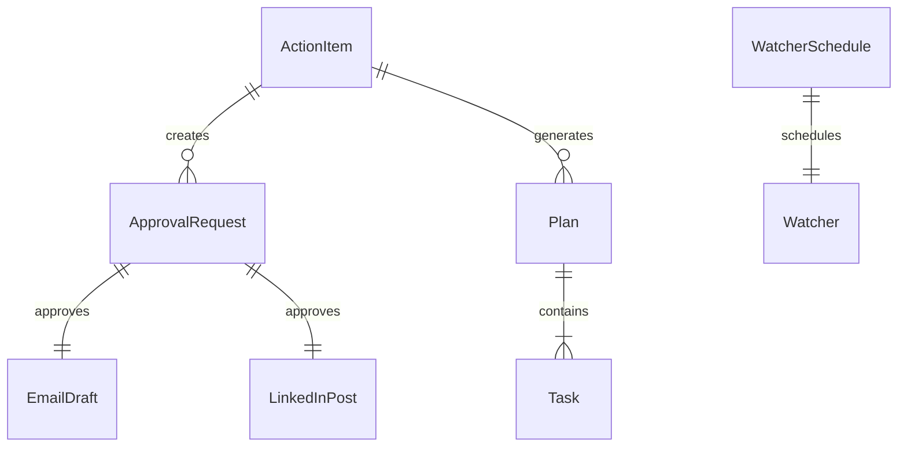

# Data Model: Silver Tier - Functional Assistant

**Feature**: 002-silver-tier
**Phase**: 2 (Silver Tier)
**Date**: 2025-02-20

---

## Entity Overview

Phase 2 extends the Bronze Tier data model with 6 new entities for approval workflow, reasoning loop, and MCP integration.

### Bronze Tier Entities (Inherited)

- **ActionItem**: Represents detected item from watchers
- **ProcessedItem**: Represents completed action
- **Watcher**: Background monitoring process

### Silver Tier Entities (New)

- **ApprovalRequest**: Human approval workflow
- **Plan**: Multi-step execution plan
- **Task**: Plan sub-task
- **LinkedInPost**: Drafted social media post
- **EmailDraft**: Drafted email
- **WatcherSchedule**: Scheduled execution configuration

---

## Entity Definitions

### ApprovalRequest

**Purpose**: Request human approval for sensitive actions

**Attributes**:
```yaml
id: string (UUID)
action_type: enum (email_send, linkedin_post, payment, other)
draft_content: string
created_at: ISO-8601 datetime
approval_status: enum (pending, approved, rejected, cancelled)
approved_at: ISO-8601 datetime (nullable)
approved_by: string
rejection_reason: string (nullable)
action_reference: string (ActionItem.id)
```

**State Transitions**:
```
pending → approved (user adds [x] Approved)
pending → rejected (user adds [x] Rejected)
pending → cancelled (user deletes file)
approved → executed (action completed)
rejected → archived (moved to /Logs/)
```

**Validation Rules**:
1. `action_type` MUST be one of: email_send, linkedin_post, payment, other
2. `approval_status` initial value MUST be `pending`
3. `approved_at` MUST be null if status is `pending`
4. `rejection_reason` required if status is `rejected`

---

### Plan

**Purpose**: Multi-step execution plan created by reasoning loop

**Attributes**:
```yaml
id: string (UUID)
title: string
created_from: string (ActionItem.id)
created_at: ISO-8601 datetime
status: enum (in_progress, complete, failed, cancelled)
tasks: array of Task
completed_at: ISO-8601 datetime (nullable)
summary: string (generated on completion)
```

**State Transitions**:
```
in_progress → complete (all tasks complete)
in_progress → failed (task failed with no retry)
in_progress → cancelled (user intervention)
complete → archived (moved to /Done/)
```

**Validation Rules**:
1. MUST have at least 2 tasks
2. `status` initial value MUST be `in_progress`
3. `completed_at` MUST be null if status is `in_progress`
4. `summary` required if status is `complete`

---

### Task (Nested in Plan)

**Purpose**: Individual step within a Plan

**Attributes**:
```yaml
step_number: integer
description: string
status: enum (pending, in_progress, complete, failed)
completed_at: ISO-8601 datetime (nullable)
error_details: string (nullable)
retry_count: integer (default 0)
```

**State Transitions**:
```
pending → in_progress (execution starts)
in_progress → complete (execution succeeds)
in_progress → failed (execution fails)
failed → pending (retry if retry_count < max)
```

**Validation Rules**:
1. `step_number` MUST be unique within Plan
2. `retry_count` MUST be < 3 (max retries)
3. `error_details` required if status is `failed`

---

### LinkedInPost

**Purpose**: Drafted LinkedIn post for approval and posting

**Attributes**:
```yaml
id: string (UUID)
content: string
hashtags: array of string
business_context: string
draft_created_at: ISO-8601 datetime
approval_status: enum (pending, approved, rejected, posted, failed)
approved_at: ISO-8601 datetime (nullable)
posted_at: ISO-8601 datetime (nullable)
post_url: string (LinkedIn URL after posting)
approval_reference: string (ApprovalRequest.id)
```

**State Transitions**:
```
pending → approved (user approves)
pending → rejected (user rejects)
approved → posted (MCP posts successfully)
approved → failed (MCP posting fails)
posted → archived (moved to /Done/)
```

**Validation Rules**:
1. `content` length MUST be < 3000 characters
2. `hashtags` MUST have at least 3 tags
3. `approval_status` initial value MUST be `pending`
4. `post_url` required if status is `posted`

---

### EmailDraft

**Purpose**: Drafted email for approval and sending

**Attributes**:
```yaml
id: string (UUID)
to: string (email address)
subject: string
body: string (HTML or plain text)
attachments: array of string (file paths)
draft_created_at: ISO-8601 datetime
approval_status: enum (pending, approved, rejected, sent, failed)
approved_at: ISO-8601 datetime (nullable)
sent_at: ISO-8601 datetime (nullable)
send_result: string (success/failure details)
approval_reference: string (ApprovalRequest.id)
```

**State Transitions**:
```
pending → approved (user approves)
pending → rejected (user rejects)
approved → sent (MCP sends successfully)
approved → failed (MCP send fails)
sent → archived (moved to /Done/)
```

**Validation Rules**:
1. `to` MUST be valid email format (RFC 5322)
2. `subject` MUST NOT be empty
3. `body` MUST NOT be empty
4. `attachments` MUST reference existing files

---

### WatcherSchedule

**Purpose**: Scheduled execution configuration for watchers

**Attributes**:
```yaml
watcher_name: string
schedule_type: enum (cron, task_scheduler)
schedule_expression: string (cron format or Task Scheduler trigger)
last_run: ISO-8601 datetime (nullable)
next_run: ISO-8601 datetime (nullable)
status: enum (active, inactive, failed)
pid: integer (process ID if running)
log_file: string (path to watcher log)
```

**State Transitions**:
```
active → inactive (watcher stopped)
active → failed (watcher crashed)
inactive → active (watcher started)
failed → active (watcher restarted)
```

**Validation Rules**:
1. `schedule_expression` MUST be valid cron or Task Scheduler format
2. `pid` MUST be null if status is `inactive`
3. `log_file` MUST reference existing file

---

## Relationships



**Relationship Rules**:
1. One ActionItem can create zero or one ApprovalRequest
2. One ApprovalRequest approves exactly one EmailDraft OR LinkedInPost
3. One ActionItem generates zero or one Plan
4. One Plan contains two or more Tasks
5. One WatcherSchedule schedules exactly one Watcher

---

## File System Mapping

| Entity | File Location | Format |
|--------|---------------|--------|
| ActionItem | /Needs_Action/*.md | Markdown + YAML frontmatter |
| ApprovalRequest | /Pending_Approval/*.md | Markdown + YAML frontmatter |
| Plan | /Plans/Plan_{id}_{timestamp}.md | Markdown + YAML frontmatter |
| EmailDraft | /Pending_Approval/email_draft_{id}.md | Markdown + YAML frontmatter |
| LinkedInPost | /Pending_Approval/linkedin_post_{id}.md | Markdown + YAML frontmatter |
| ProcessedItem | /Done/*.md | Markdown + YAML frontmatter |
| WatcherSchedule | /phase-2/config/schedules.json | JSON |

---

## Data Access Patterns

### Creating ApprovalRequest

```python
def create_approval_request(action_item: ActionItem) -> ApprovalRequest:
    approval = ApprovalRequest(
        id=generate_uuid(),
        action_type=action_item.action_type,
        draft_content=action_item.content,
        created_at=datetime.now().isoformat(),
        approval_status='pending',
        action_reference=action_item.id
    )
    write_to_vault(f'/Pending_Approval/action_{approval.id}.md', approval)
    return approval
```

### Creating Plan

```python
def create_plan(action_item: ActionItem) -> Plan:
    plan = Plan(
        id=generate_uuid(),
        title=f"Plan: {action_item.title}",
        created_from=action_item.id,
        created_at=datetime.now().isoformat(),
        status='in_progress',
        tasks=decompose_into_tasks(action_item)
    )
    write_to_vault(f'/Plans/Plan_{plan.id}_{datetime.now().strftime("%Y%m%d_%H%M%S")}.md', plan)
    return plan
```

### Updating Plan Task

```python
def update_task_status(plan: Plan, task_number: int, status: str):
    task = plan.tasks[task_number - 1]
    task.status = status
    if status == 'complete':
        task.completed_at = datetime.now().isoformat()
    update_plan_file(plan)
```

---

## Constraints & Invariants

1. **No Orphaned Approvals**: All ApprovalRequests must reference valid ActionItem
2. **No Orphaned Plans**: All Plans must reference valid ActionItem
3. **Unique IDs**: All entity IDs must be unique across the system
4. **Timestamp Ordering**: `created_at` < `approved_at` < `completed_at` (if not null)
5. **Status Consistency**: Entity status must match state transitions

---

## Index & Query Patterns

### Common Queries

1. **Find Pending Approvals**: Scan `/Pending_Approval/` for `status: pending`
2. **Find In-Progress Plans**: Scan `/Plans/` for `status: in_progress`
3. **Find Watcher by Name**: Scan `schedules.json` for `watcher_name`
4. **Count Actions by Source**: Scan `/Needs_Action/` and group by `source`

### Performance Considerations

- File scanning is acceptable for Silver tier (small scale)
- Consider indexing for Gold+ tier (larger scale)
- Cache watcher schedules in memory

---

## Migration Path (from Bronze to Silver)

### Step 1: Add Silver Folders
```bash
mkdir -p AI_Employee_Vault/Pending_Approval
mkdir -p AI_Employee_Vault/Plans
```

### Step 2: Update Dashboard.md
Add Silver status sections (multi-watcher activity, pending approvals, active plans)

### Step 3: Update Company_Handbook.md
Add Silver rules (approval workflow, MCP usage, scheduling)

### Step 4: No Data Migration Required
- Bronze files remain in place
- Silver creates new files only
- No breaking changes

---

**Data Model Status**: ✅ Complete
**Version**: 1.0
**Last Updated**: 2025-02-20
